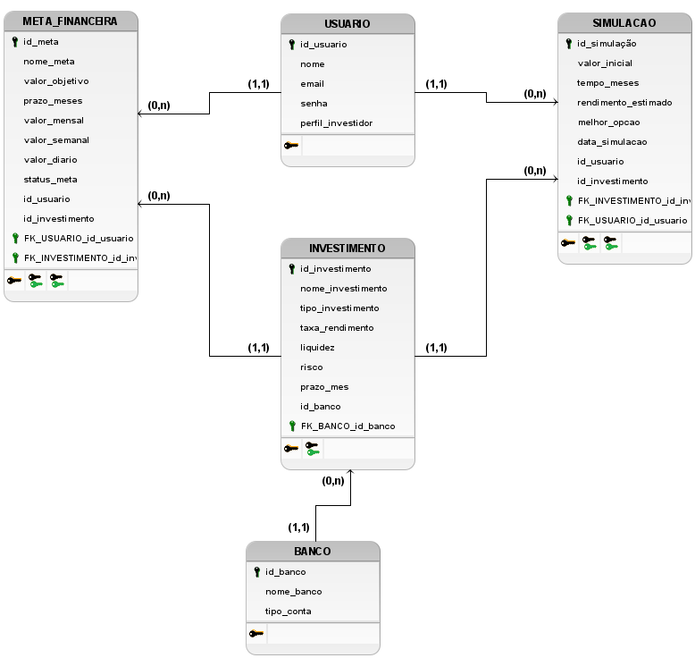

# financial-control

> Projeto de modelagem de banco de dados para um sistema financeiro desenvolvido em Java, com metodologia SCRUM.

---

## 🗂️ Modelo Lógico


## 📋 Sobre o Projeto

O **Projeto Java Finanças** é uma plataforma de gerenciamento financeiro pessoal desenvolvida em Java, que permite ao usuário organizar suas finanças, comparar opções bancárias e acompanhar suas metas financeiras de forma prática e intuitiva.

---

## 🎯 Objetivos

A plataforma foi desenvolvida para ser capaz de:

- 🔍 **Simular** investimentos e rendimentos
- 🏦 **Comparar bancos** e suas condições
- 🎯 **Auxiliar metas financeiras** pessoais
- 📊 **Organizar informações financeiras** de forma centralizada

---

## 🛠️ Metodologia

Este projeto foi desenvolvido seguindo a metodologia ágil **SCRUM**, com:

- Sprints semanais
- Reuniões de planejamento e revisão
- Backlog priorizado por valor de negócio

---

## 📁 Estrutura do Repositório

```text
financial-control/
├── brmodelo/
│   └── modelo-logico.png
└── README.md
